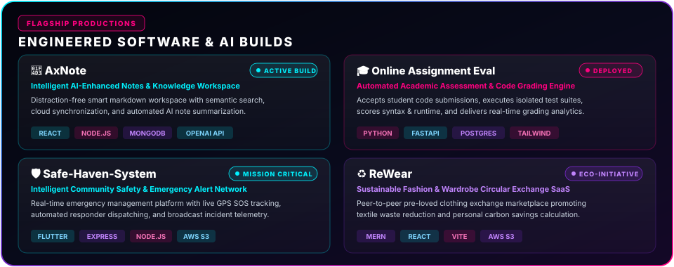

<!-- ================================================================= -->
<!-- ✦ 1. OPENING ANIMATION // HOLOGRAPHIC AURORA HERO ✦ -->
<!-- ================================================================= -->

  

 

<!-- ================================================================= -->
<!-- ⚡ 2. DYNAMIC ANIMATED TYPING ROLES -->
<!-- ================================================================= -->

  

<!-- Quick Transmission Action Badges -->

  
  
  
  

  

<!-- ================================================================= -->
<!-- 👤 3. ABOUT ME // NEURAL ID & MISSION TELEMETRY -->
<!-- ================================================================= -->

  

  

<!-- ================================================================= -->
<!-- 🛠️ 4. TECH ARSENAL // 5 CORE PILLARS -->
<!-- ================================================================= -->

  

 

<!-- Unified High-Definition Dark Icon Strip -->

  

  

<!-- ================================================================= -->
<!-- 🚀 5. FEATURED PROJECTS // PRODUCTION BUILDS -->
<!-- ================================================================= -->

  

 

<!-- Interactive Quick Links to Repositories -->

  <table width="98%" border="0" cellpadding="8">
    <tr align="center">
      <td width="25%">
        
      </td>
      <td width="25%">
        
      </td>
      <td width="25%">
        
      </td>
      <td width="25%">
        
      </td>
    </tr>
  </table>

  

<!-- ================================================================= -->
<!-- 📊 6. GITHUB TELEMETRY & STREAK HUD -->
<!-- ================================================================= -->

  <table border="0" cellpadding="0" cellspacing="0">
    <tr>
      <td align="center">
        
      </td>
      <td align="center">
        
      </td>
    </tr>
  </table>

 

<!-- Streak Counter -->

  

 

<!-- Contribution Graph Heatmap with Snake -->

  
<b>✦ NEURAL CONTRIBUTION RADAR ✦</b>

  <a href="https://github.com/JosephPrasa">
    <picture>
      <source media="(prefers-color-scheme: dark)" srcset="https://raw.githubusercontent.com/JosephPrasa/JosephPrasa/output/github-contribution-grid-snake-dark.svg">
      <source media="(prefers-color-scheme: light)" srcset="https://raw.githubusercontent.com/JosephPrasa/JosephPrasa/output/github-contribution-grid-snake.svg">
      
    </picture>
  </a>

  

<!-- ================================================================= -->
<!-- 🌐 7. COMMUNICATION CHANNELS // CONNECT WITH ME -->
<!-- ================================================================= -->

 

<!-- ================================================================= -->
<!-- ✦ 8. CLOSING ANIMATION // AURORA FOOTER & AUTHOR QUOTE ✦ -->
<!-- ================================================================= -->

  

