<!-- ================================================================= -->
<!-- ⚡ CYBERPUNK NEON ANIMATED HERO HEADER ⚡ -->
<!-- ================================================================= -->
<div align="center">
  
</div>

<!-- ================================================================= -->
<!-- 💻 DYNAMIC ANIMATED TYPING ROLES -->
<!-- ================================================================= -->
<div align="center">
  <a href="https://github.com/JosephPrasa">
    
  </a>
</div>

<!-- Quick Action Badges -->
<p align="center">
  <a href="mailto:YOUR_EMAIL@example.com">
    
  </a>
  <a href="https://github.com/JosephPrasa?tab=repositories">
    
  </a>
  <a href="https://komarev.com/ghpvc/?username=JosephPrasa&label=PROFILE_ACCESS_LOG&color=9D4EDD&style=for-the-badge">
    
  </a>
</p>

<div align="center">
  
</div>

<!-- ================================================================= -->
<!-- 📡 SYSTEM LOGS // ABOUT ME -->
<!-- ================================================================= -->
### ⚡ `SYSTEM_KERNEL // ABOUT_ME`

```bash
┌── [root@josephprasa-workstation] ── [~/core/identity]
├── $ cat developer_profile.json
{
  "engineer": "Joseph Prasa",
  "specialization": ["Full Stack Software Engineering", "MERN Stack", "Systems Architecture"],
  "mission": "Bridging low-level systems precision with high-octane modern web architectures",
  "current_focus": ["AxNote Workspace", "Safe-Haven Security", "ReWear Circular Economy"],
  "status": "Available for High-Impact Software Engineering Opportunities"
}
└── $ ./diagnostics.sh --status
    [OK] Core Languages: C/C++, Python, Java, JS, PHP
    [OK] Frontend: React, Vite, Tailwind CSS, Flutter
    [OK] Backend & DB: Node.js, Express, PostgreSQL, MongoDB
    [OK] Cloud & DevOps: AWS, Linux, Git/GitHub
```

- 🔭 **Primary Engineering Focus:** Crafting full-stack digital solutions and architecting scalable backend APIs with **Node.js, Express, PostgreSQL & MongoDB**.
- ⚙️ **Low-Level Foundation:** Rigorous foundation in **C/C++, Systems Programming, Algorithms, and Linux Environments**.
- 📱 **Cross-Platform & Modern UI:** Building interactive, reactive interfaces using **React, Vite, Tailwind CSS, and Flutter**.
- 🚀 **Currently Developing:** Scaling **AxNote** (knowledge app), hardening **Safe-Haven-System** (emergency alert network), and advancing **ReWear** (sustainable marketplace).
- 💬 **Ask Me About:** MERN Stack Architecture, System Design, Embedded & C/C++ Concepts, Cloud Deployment on AWS.
- ⚡ **Engineering Philosophy:** *"Premature optimization is the root of all evil — but elegant design and clean architecture are non-negotiable."*

<div align="center">
  
</div>

<!-- ================================================================= -->
<!-- 🛠️ TECH STACK MATRIX -->
<!-- ================================================================= -->
### 🛠️ `TECH_MATRIX // CAPABILITIES`

<div align="center">
  <a href="https://skillicons.dev">
    
  </a>
</div>

<br />

<table align="center" width="100%">
  <thead>
    <tr>
      <th width="25%" align="center">⚙️ Core & Systems</th>
      <th width="25%" align="center">🎨 Frontend & Mobile</th>
      <th width="25%" align="center">🔌 Backend & APIs</th>
      <th width="25%" align="center">☁️ Cloud & Databases</th>
    </tr>
  </thead>
  <tbody>
    <tr>
      <td align="left" valign="top">
        • <b>C / C++</b> (Systems & Alg.)<br/>
        • <b>Python</b> (Scripting & Automation)<br/>
        • <b>Java</b> (OOP & Foundations)<br/>
        • <b>PHP</b> (Backend Web Dev)<br/>
        • <b>Linux CLI & Shell</b><br/>
        • <b>Data Structures & Algo</b>
      </td>
      <td align="left" valign="top">
        • <b>React.js</b> (SPAs & Hooks)<br/>
        • <b>Vite</b> (Next-Gen Bundling)<br/>
        • <b>Tailwind CSS</b> (Utility Design)<br/>
        • <b>Flutter</b> (Cross-Platform Mobile)<br/>
        • <b>JavaScript (ES6+)</b><br/>
        • <b>HTML5 & CSS3</b>
      </td>
      <td align="left" valign="top">
        • <b>Node.js Runtime</b><br/>
        • <b>Express.js Framework</b><br/>
        • <b>RESTful API Design</b><br/>
        • <b>MERN Stack Architecture</b><br/>
        • <b>Authentication & JWT</b><br/>
        • <b>Microservice Concepts</b>
      </td>
      <td align="left" valign="top">
        • <b>PostgreSQL</b> (Relational SQL)<br/>
        • <b>MongoDB</b> (NoSQL / Documents)<br/>
        • <b>AWS Cloud Services</b><br/>
        • <b>Git & GitHub VCS</b><br/>
        • <b>CI/CD Pipelines</b><br/>
        • <b>Embedded Systems</b>
      </td>
    </tr>
  </tbody>
</table>

<div align="center">
  
</div>

<!-- ================================================================= -->
<!-- 🚀 FEATURED FLAGSHIP PROJECTS -->
<!-- ================================================================= -->
### 🚀 `FLAGSHIP_PROJECTS // ACTIVE_BUILDS`

<table width="100%">
  <tr>
    <!-- PROJECT 1: AxNote -->
    <td width="50%" valign="top">
      <div align="left">
        <h3 style="margin-bottom: 4px;">📓 AxNote</h3>
        <p>
          
          
          
          
        </p>
        <p>
          <b>Intelligent Modern Notes & Knowledge Workspace</b><br/>
          A distraction-free, high-performance notes application engineered with markdown editing, hierarchical tagging, fuzzy search, and cloud synchronization for capturing developer thoughts seamlessly.
        </p>
        <p>
          <a href="https://github.com/JosephPrasa/AxNote"><b>[ View Source Code ]</b></a> •
          <a href="https://github.com/JosephPrasa/AxNote"><b>[ Live Demo ]</b></a>
        </p>
      </div>
    </td>
    <!-- PROJECT 2: Online Assignment Evaluation System -->
    <td width="50%" valign="top">
      <div align="left">
        <h3 style="margin-bottom: 4px;">🎓 Online Assignment Evaluation System</h3>
        <p>
          
          
          
          
        </p>
        <p>
          <b>Automated Academic Assessment & Code Grading Engine</b><br/>
          An automated evaluation platform for academic institutions that accepts code submissions, runs test suites in isolated sandboxes, provides automated grading metrics, and generates instant performance analytics.
        </p>
        <p>
          <a href="https://github.com/JosephPrasa/online-assignment-evaluation-system"><b>[ View Source Code ]</b></a> •
          <a href="https://github.com/JosephPrasa/online-assignment-evaluation-system"><b>[ Live Demo ]</b></a>
        </p>
      </div>
    </td>
  </tr>
  <tr>
    <!-- PROJECT 3: Safe-Haven-System -->
    <td width="50%" valign="top">
      <div align="left">
        <h3 style="margin-bottom: 4px;">🛡️ Safe-Haven-System</h3>
        <p>
          
          
          
          
        </p>
        <p>
          <b>Intelligent Community Safety & Emergency Alert Network</b><br/>
          A mission-critical emergency alerting platform connecting citizens with rapid responders. Features real-time GPS tracking, SOS broadcast dispatching, and secure incident management reporting.
        </p>
        <p>
          <a href="https://github.com/JosephPrasa/safe-haven-system"><b>[ View Source Code ]</b></a> •
          <a href="https://github.com/JosephPrasa/safe-haven-system"><b>[ Live Demo ]</b></a>
        </p>
      </div>
    </td>
    <!-- PROJECT 4: ReWear -->
    <td width="50%" valign="top">
      <div align="left">
        <h3 style="margin-bottom: 4px;">♻️ ReWear</h3>
        <p>
          
          
          
          
        </p>
        <p>
          <b>Sustainable Fashion & Wardrobe Circular Exchange</b><br/>
          A community-driven marketplace built to reduce textile waste. Facilitates peer-to-peer pre-loved clothing exchanges, wardrobe virtualization, and calculates personal carbon footprint savings.
        </p>
        <p>
          <a href="https://github.com/JosephPrasa/rewear"><b>[ View Source Code ]</b></a> •
          <a href="https://github.com/JosephPrasa/rewear"><b>[ Live Demo ]</b></a>
        </p>
      </div>
    </td>
  </tr>
</table>

<div align="center">
  
</div>

<!-- ================================================================= -->
<!-- 📊 GITHUB ANALYTICS & STREAK HUD -->
<!-- ================================================================= -->
### 📊 `TELEMETRY // GITHUB_ANALYTICS`

<div align="center">
  <table border="0" cellpadding="0" cellspacing="0">
    <tr>
      <td align="center">
        <a href="https://github.com/JosephPrasa">
          
        </a>
      </td>
      <td align="center">
        <a href="https://github.com/JosephPrasa">
          
        </a>
      </td>
    </tr>
  </table>
</div>

<br />

<!-- Streak Counter -->
<div align="center">
  <a href="https://github.com/JosephPrasa">
    
  </a>
</div>

<br />

<!-- Contribution Graph Heatmap -->
<div align="center">
  <p><b>⚡ CONTRIBUTION RADAR ⚡</b></p>
  <a href="https://github.com/JosephPrasa">
    <picture>
      <source media="(prefers-color-scheme: dark)" srcset="https://raw.githubusercontent.com/JosephPrasa/JosephPrasa/output/github-contribution-grid-snake-dark.svg">
      <source media="(prefers-color-scheme: light)" srcset="https://raw.githubusercontent.com/JosephPrasa/JosephPrasa/output/github-contribution-grid-snake.svg">
      
    </picture>
  </a>
</div>

<div align="center">
  
</div>

<!-- ================================================================= -->
<!-- 🌐 TRANSMISSION // CONNECT WITH ME -->
<!-- ================================================================= -->
### 🌐 `COMMUNICATION_CHANNELS // CONNECT`

<div align="center">

<a href="https://linkedin.com/in/YOUR_LINKEDIN_USERNAME" target="_blank">
  
</a>
<a href="mailto:YOUR_EMAIL@example.com" target="_blank">
  
</a>
<a href="https://github.com/JosephPrasa" target="_blank">
  
</a>
<a href="https://twitter.com/YOUR_TWITTER_USERNAME" target="_blank">
  
</a>
<a href="https://discord.com/users/YOUR_DISCORD_USER_ID" target="_blank">
  
</a>
<a href="https://YOUR_PORTFOLIO_SITE.com" target="_blank">
  
</a>

</div>

<br />

<!-- ================================================================= -->
<!-- ⚡ CYBERPUNK NEON FOOTER ⚡ -->
<!-- ================================================================= -->
<div align="center">
  
</div>
